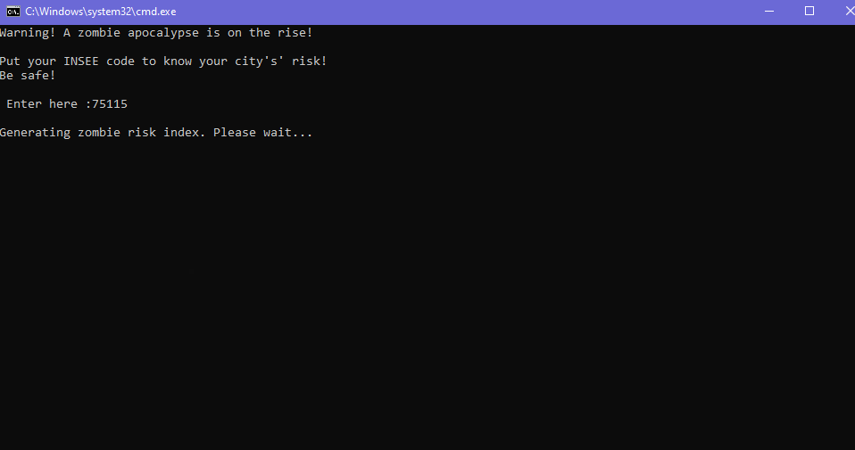

# 🧟 Zombification Risk Mapping — France

> A tutorial on how to build a **zombification risk map** scored per IRIS in France using open data from BDTOPO, INSEE, and OpenStreetMap.


---

## 📖 Project Description

This script is a tutorial on how to build a **zombification risk map** with a composite score per [IRIS](https://www.insee.fr/fr/metadonnees/definition/c1523) (France's finest infra-communal statistical unit).

All you need to do is **enter the INSEE code** of any commune in France and the script will generate a choropleth risk map automatically.

### 🧮 How the Zombie Score Is Computed

The higher the score, the **more dangerous** the IRIS:

| Factor | Weight | Logic |
|--------|--------|-------|
| 🪦 Number of cemeteries in the IRIS & proximity to the nearest one | **×0.35** | More cemeteries & closer = more undead spawns |
| ✈️ Proximity to an airport / airfield | **×0.20** | Closer = faster pandemic spread |
| 👥 Population density | **×0.15** | Higher density = more targets |
| 👴 Ratio of people aged 75+ | **×0.10** | Higher ratio = more vulnerable population |
| ♿ Number of disabled people (AAH recipients) | **×0.10** | Higher count = more vulnerable population |
| 🔫 Proximity to a weapon shop | **×0.10** | Closer = paradoxically more dangerous (looting, chaos) |

Each factor is **normalised between 0 and 1** using `MinMaxScaler`, then combined into a weighted score:

```python
population_iris['zombie_score'] = (
    (1 - norm_cemetery) * 0.15 +   # closer to a cemetery  → higher score
    norm_nb_cemetry     * 0.20 +   # more cemeteries       → higher score
    norm_density        * 0.15 +   # denser population     → higher score
    norm_elderly        * 0.10 +   # more elderly          → higher score
    norm_disabled       * 0.10 +   # more disabled people  → higher score
    (1 - norm_airfield) * 0.20 +   # closer to an airport  → higher score
    (1 - norm_weapons)  * 0.10     # closer to weapon shop → higher score
)
```

---

## 🗂️ Datasets Used

| Dataset | Source | File |
|---------|--------|------|
| Cemetery points & polygons | [BDTOPO 2026](https://geoservices.ign.fr/bdtopo) | `data/cimetieres.gpkg` |
| Population density | [INSEE — base IRIS 2022](https://www.insee.fr/fr/statistiques/7632867) | `data/base-ic-evol-struct-pop-2022.CSV` |
| 75+ year-old ratio | [INSEE — base IRIS 2022](https://www.insee.fr/fr/statistiques/7632867) | `data/base-ic-evol-struct-pop-2022.CSV` |
| Disabled people (AAH recipients) | [CAF / INSEE 2021](https://www.insee.fr/fr/statistiques/6679585) | `data/data_CAF2021_IRIS.csv` |
| Airfields & airports | [BDTOPO 2026](https://geoservices.ign.fr/bdtopo) | `data/BDTopoExport_20260306_1443/bd_topo_extract.gpkg` |
| Weapon shops | [OpenStreetMap (OSM)](https://www.openstreetmap.org/) | `data/weapon_shops.geojson` |
| IRIS contours | [IGN CONTOURS-IRIS 2022](https://geoservices.ign.fr/contoursiris) | `data/CONTOURS-IRIS_2-1__SHP__FRA_2022-01-01/` |

> ⚠️ **Note:** Some large datasets (`CONTOURS-IRIS .shp`, `cimetieres.gpkg`, `base-ic-evol-struct-pop-2022.CSV`) exceed GitHub's 100 MB file limit and are **not included** in this repository. You will need to download them manually from the links above and place them in the `data/` folder.

---

## 🚀 Getting Started

### Prerequisites

- **Python 3.10+**
- The required libraries (see below)

### Installation

```bash
# Clone the repository
git clone https://github.com/kalmahj/zombification-risk-map.git
cd zombification-risk-map

# Install dependencies
pip install -r requirements.txt
```

### Download the missing data

Download the following datasets and place them in the `data/` folder:

1. **CONTOURS-IRIS 2022** → [Download from IGN](https://geoservices.ign.fr/contoursiris)
   - Extract into `data/CONTOURS-IRIS_2-1__SHP__FRA_2022-01-01/`
2. **Cimetières (BDTOPO 2026)** → [Download from IGN](https://geoservices.ign.fr/bdtopo)
   - Save as `data/cimetieres.gpkg`
3. **Base IC Évolution Structure Population 2022** → [Download from INSEE](https://www.insee.fr/fr/statistiques/7632867)
   - Save as `data/base-ic-evol-struct-pop-2022.CSV`

### Run the script

```bash
python zombification.py
```

You will be prompted to enter an **INSEE commune code** (e.g., `75115` for Paris 15e):

```
Warning! A zombie apocalypse is on the rise!

Put your INSEE code to know your city's risk!
Be safe!

 Enter here: 75115

Generating zombie risk index. Please wait...
```

The script will generate a `zombie_map.html` file — open it in your browser to explore the interactive map! 🗺️

---

## 🐍 Code Walkthrough

The main script `zombification.py` follows these steps:

### Step 0 — User Input
```python
city = input("Warning! A zombie apocalypse is on the rise! \n\nPut your INSEE code to know your city's' risk! \nBe safe!\n\n Enter here :")
```

### Step 1.1 — Population Density per IRIS
```python
contour_iris = gpd.read_file(r"data\CONTOURS-IRIS_2-1__SHP__FRA_2022-01-01\...\CONTOURS-IRIS.shp")
population_insee = pd.read_csv(r"data\base-ic-evol-struct-pop-2022.CSV", sep=";")

# Compute area in km² and merge population data
contour_iris["area"] = contour_iris['geometry'].area / 10**6
population_iris = contour_iris.merge(population_insee[['CODE_IRIS', 'P22_POP']], on='CODE_IRIS', how='left')
population_iris['Density km²'] = population_iris['P22_POP'] / population_iris['area']
```

### Step 1.2 — Elderly Ratio (75+ years old)
```python
population_iris = population_iris.merge(population_insee[['CODE_IRIS', 'P22_POP75P']], on='CODE_IRIS', how='left')
population_iris["% 75+ ans"] = (population_iris['P22_POP75P'] * 100) / population_iris['P22_POP']
```

### Step 1.3 — Disabled People (AAH Recipients)
```python
disabled = pd.read_csv(r"data\data_CAF2021_IRIS.csv", sep=';')
disabled['AAAH'] = disabled['AAAH'].fillna(disabled['AAAH'].mean())
population_iris = pd.merge(population_iris, disabled[['CODGEO', 'AAAH']], how='left',
                           left_on='CODE_IRIS', right_on='CODGEO')
```

### Step 1.4 — Cemetery Proximity (BDTOPO)
```python
cemetries = gpd.read_file(r"data\cimetieres.gpkg")
cemetries = cemetries.dissolve().explode()
population_iris = gpd.sjoin_nearest(population_iris, cemetries[['cleabs', 'geometry']],
                                     how='left', distance_col='distance_cemetry')
```

### Step 1.5 — Airport Proximity (BDTOPO)
```python
airfields = gpd.read_file(r"data\BDTopoExport_20260306_1443\bd_topo_extract.gpkg")
population_iris = gpd.sjoin_nearest(population_iris, airfields[['cleabs', 'geometry']],
                                     how='left', distance_col='distance_airfield')
```

### Step 1.6 — Weapon Shop Proximity (OSM)
```python
weapon_shops = gpd.read_file(r"data\weapon_shops.geojson", driver='GeoJSON')
weapon_shops = weapon_shops.to_crs(2154)
population_iris = gpd.sjoin_nearest(population_iris, weapon_shops[['full_id', 'geometry']],
                                     how='left', distance_col='distance_weapon_shops')
```

### Step 1.7 — Number of Cemeteries per IRIS
```python
joinjoin = population_iris.sjoin(cemetries, how='left')
nbr = joinjoin.groupby('CODE_IRIS').size().to_frame(name='nb_cemetries')
population_iris = pd.merge(population_iris, nbr, left_on='CODE_IRIS', right_index=True, how='left')
population_iris['nb_cemetries'] = population_iris['nb_cemetries'].fillna(0)
```

### Step 2 — Score Normalisation & Computation
```python
from sklearn.preprocessing import MinMaxScaler

scaler = MinMaxScaler()
def normalize_column(series):
    series = series.astype(float)
    return scaler.fit_transform(series.values.reshape(-1, 1)).ravel()

population_iris['zombie_score'] = (
    (1 - normalize_column(population_iris['distance_cemetry']))   * 0.15 +
    normalize_column(population_iris['nb_cemetries'])             * 0.20 +
    normalize_column(population_iris['Density km²'])              * 0.15 +
    normalize_column(population_iris['% 75+ ans'])                * 0.10 +
    normalize_column(population_iris['AAAH'])                     * 0.10 +
    (1 - normalize_column(population_iris['distance_airfield']))  * 0.20 +
    (1 - normalize_column(population_iris['distance_weapon_shops'])) * 0.10
)
```

### Step 3 — Interactive Folium Map
```python
import folium as fol

test_com = population_iris_filtered[population_iris_filtered['INSEE_COM'] == city]
test_com = test_com.to_crs({'init': 'epsg:4326'})

zombie_map = fol.Map(tiles='OpenStreetMap')
fol.Choropleth(
    geo_data=test_com[["CODE_IRIS", "geometry"]],
    data=test_com,
    columns=["CODE_IRIS", "zombie_score"],
    key_on="feature.properties.CODE_IRIS",
    fill_color="RdYlBu_r",
    fill_opacity=0.7,
    legend_name="Zombie risk index (%)",
    bins=dynamic_bins
).add_to(zombie_map)

zombie_map.save('zombie_map.html')
```

---

## 📸 Preview

| Terminal Prompt | Generated Map |
|:-:|:-:|
|  | *Open `zombie_map.html` in your browser* |

---

## 📚 Libraries Used

| Library | Purpose |
|---------|---------|
| [geopandas](https://geopandas.org/) | Spatial data manipulation |
| [pandas](https://pandas.pydata.org/) | Tabular data processing |
| [numpy](https://numpy.org/) | Numerical operations |
| [folium](https://python-visualization.github.io/folium/) | Interactive Leaflet maps |
| [branca](https://github.com/python-visualization/branca) | Colormaps for Folium |
| [scikit-learn](https://scikit-learn.org/) | MinMaxScaler for normalisation |

---

## 📝 License

This project is licensed under the MIT License — see the [LICENSE](LICENSE) file for details.

---

## 👤 Author

**Kalma Hazara**

---

*Made with 🧟 and Python*
